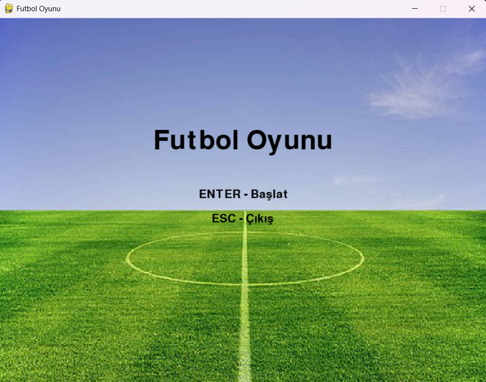
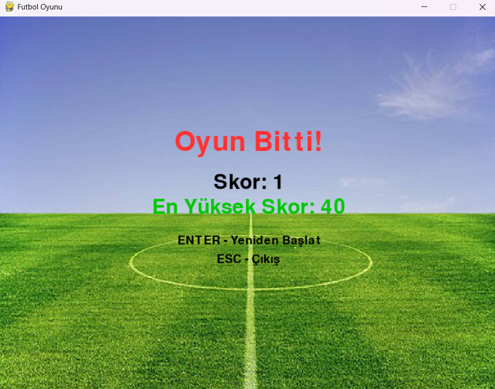
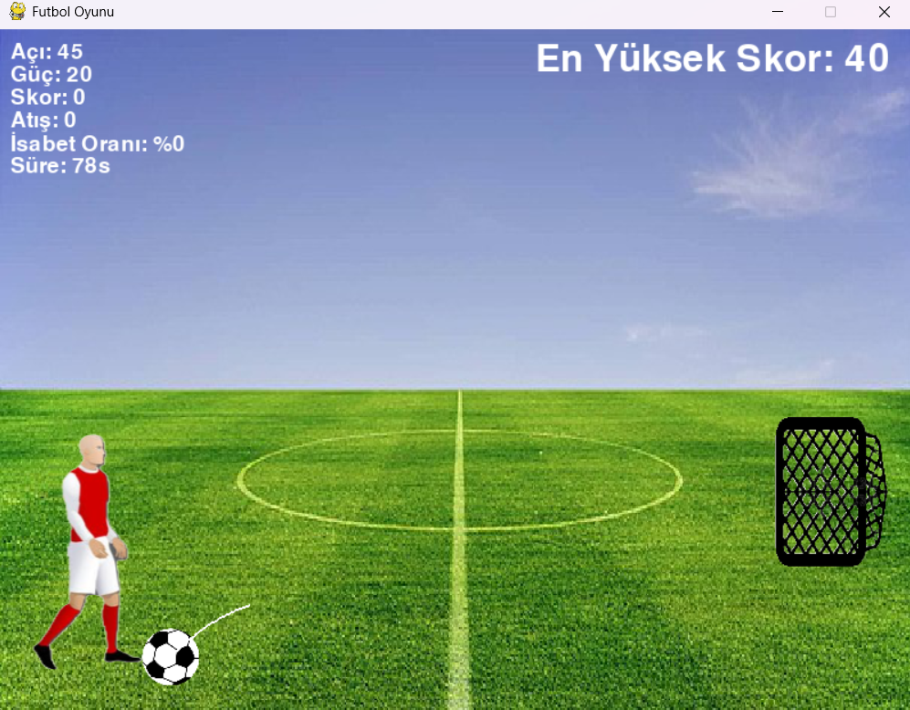
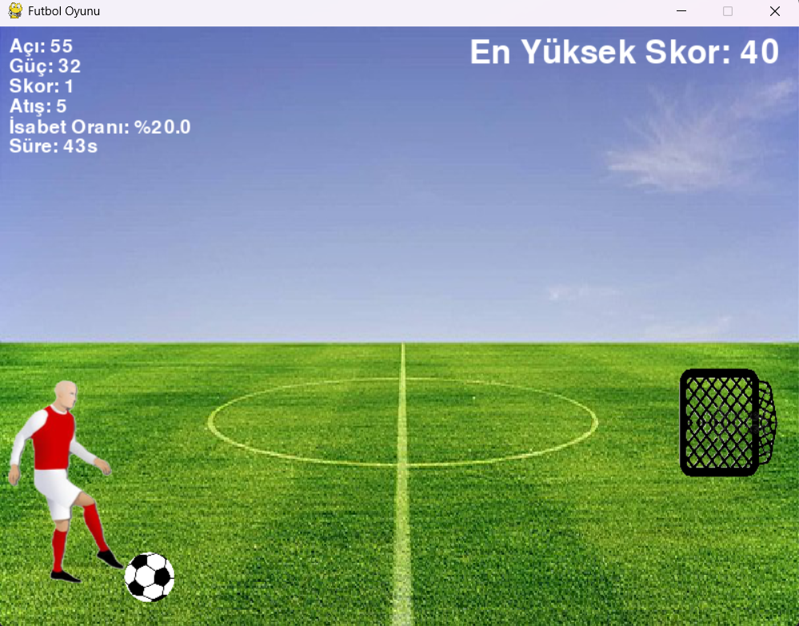

# ⚽ Futbol Oyunu (Pygame)

Bu proje, Pygame kütüphanesi ile geliştirilmiş 2D bir futbol şut oyunu. Oyuncu, topun açısını ve gücünü ayarlayarak kaleye şut çekmeye çalışır. Belirli bir süre içinde mümkün olduğunca fazla gol atmak hedeflenir.

## 🖼️ Oyun Görselleri

Aşağıda oyunda kullanılan bazı görselleri görebilirsiniz:

### Menüler
<p float="left">


</p>

### Oyun
<p float="left">


</p>

## 🎮 Özellikler

- Açılı ve güçlü şut mekanizması
- Gerçekçi yerçekimi ve zıplama fiziği
- Kaleye isabetli şutlar ile skor kazanımı
- Rastsal kaleler (hoop) ile zorluk artışı
- Şut animasyonları
- En yüksek skor kaydı (dosyada saklanır)
- Basit menü ve oyun sonu ekranı

## ⌨️ Kontroller

| Tuş   | İşlev                             |
| ----- | --------------------------------- |
| ↑     | Açı artır                         |
| ↓     | Açı azalt                         |
| →     | Güç artır                         |
| ←     | Güç azalt                         |
| SPACE | Şut çek                           |
| ENTER | Menüden başla veya yeniden başlat |
| ESC   | Oyundan çık                       |

## 🧠 Oyun Mekanikleri

- Top, açısına ve gücüne göre fırlatılır ve yerçekiminden etkilenir.
- Top kaleye çarparsa skor artar ve kale yeri değişir.
- Top yere düşerse, 3 sekmeye kadar devam eder, sonra sıfırlanır.
- Oyuncuya toplam 90 saniye süre verilir.
- Oyun sonunda isabet oranı ve skor gösterilir.
- En yüksek skor `highest_score.txt` dosyasına kaydedilir.

## 🔧 Kurulum

1. Python 3 kurulu olmalı.
2. Pygame kütüphanesini yükle:

```bash
pip install pygame
```

3. Tüm resim dosyalarıyla birlikte `futbol.py` dosyasını aynı klasöre yerleştir.
4. Oyunu başlat:

```bash
python futbol.py
```

## 📁 Dosya Yapısı

```
futbol.py
stadyum.png
run1.png
run2.png
run3.png
run4.png
futboltopu.png
kale.png
highest_score.txt (otomatik oluşur)
README.md
```

## 📜 Lisans

Bu proje eğitim ve kişisel kullanım amaçlıdır. Ticari kullanım için geliştirici izni gereklidir.

---

İyi eğlenceler! 🎉
